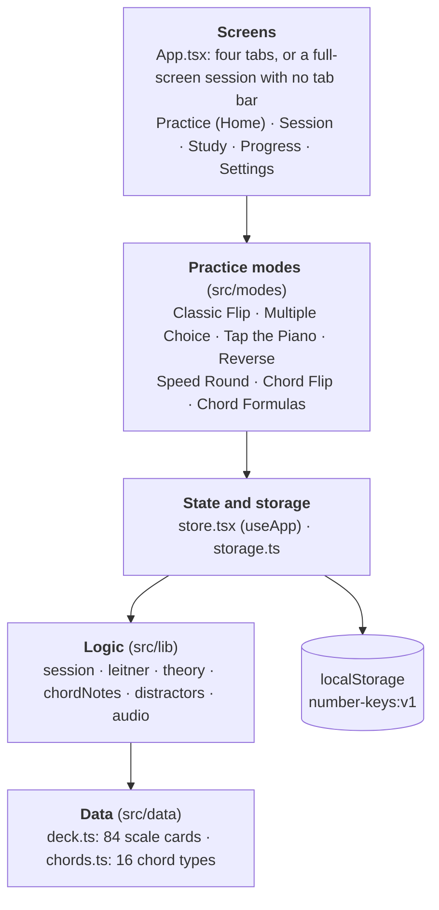

# Number Keys: Project Documentation

> Keep this file in step with the code. When a change alters behavior, structure, counts or rules described here, update this file (and [USER_GUIDE.md](USER_GUIDE.md) if users would notice) in the same commit.

## Overview

Number Keys is a flash card web app that teaches piano players to name scale tones and chord tones by number in all 12 major keys. It is a client-only progressive web app: no backend, no login, and all progress lives in the browser's localStorage.

- **Live site:** https://number-keys.netlify.app
- **Source:** https://github.com/fcasonjr/number-keys (branch `main`)
- **Deployment:** Netlify rebuilds and publishes on every push to `main`.
- **User-facing guide:** [USER_GUIDE.md](USER_GUIDE.md)

### What it does today

| Area | Contents |
| --- | --- |
| Scale deck | 84 cards: 7 degrees in each of 12 keys, in circle-of-fourths order |
| Chord deck | 192 cards: 16 chord types (major, minor, dominant, sus, dim/aug) in each of 12 keys |
| Practice modes | Classic Flip, Multiple Choice, Tap the Piano, Reverse, Speed Round, Chord Flip, Chord Formulas |
| Filters | Keys, degrees, chord types; presets; double-tap to select one; Original, Shuffled and Smart review order |
| Spaced repetition | Leitner boxes per card, with a mastery rule; shared by scale and chord cards |
| Study tab | Labeled keyboards for every scale and every chord type |
| Progress tab | Two heat-maps (scales, chords), day streak, mastered and seen counts |
| Data | Settings for sound, theme and F# instead of Gb; JSON export, import and reset |

The original brief (a prompt file, kept out of the repo) asked for a trainer based on a printed 84-card set, with the answer table treated as the source of truth. Chord Flip, the other chord types and the chord study views were added afterwards.

## Tech stack and commands

The app has two runtime dependencies (React and React DOM) and builds with Vite. About 1,700 lines of TypeScript and TSX live under `src/`.

| Layer | Choice |
| --- | --- |
| Language | TypeScript 7 |
| UI | React 19 |
| Build tool | Vite 8 with `@vitejs/plugin-react` |
| PWA | `vite-plugin-pwa` 1.3 (generated service worker, `autoUpdate`) |
| Tests | Vitest 5 (`tests/**/*.test.ts`) |
| Styling | One plain CSS file, `src/styles.css`, using CSS variables for light and dark themes |

### Commands

```bash
npm install
npm run dev       # Vite dev server on the LAN (--host), usually http://localhost:5173
npm test          # vitest run
npm run build     # tsc --noEmit && vite build; this is also the typecheck
npm run preview   # serve dist/ (the service worker only runs here, not in dev)

# one test file, or one test by name
npx vitest run tests/chords.test.ts
npx vitest run tests/logic.test.ts -t "moves up on correct"
```

There is no linter. `npm run build` is the type gate, and `npm test` is the correctness gate for the music rules.

## Architecture

The app is five layers, and each layer only calls the one below it. Screens and modes show cards and collect answers, one store keeps all progress, plain functions in `src/lib` hold the rules, and `src/data` holds the facts.



### What happens when you answer a card

1. A mode component calls `onAnswer(ok, ms)` once, with the time taken.
2. Its parent (`Session`, `SpeedRound`, `ChordFlip` or `ChordDrill`) calls `record` or `recordChord` from `useApp()` with the card id.
3. The store runs `applyAnswer()` from `leitner.ts` and updates that card's stats, the daily count and the total.
4. An effect in `StoreProvider` saves the new store to localStorage.
5. Progress and the Smart review ordering read the same store, so they update at once.

### Key pieces

- **App shell** (`src/App.tsx`). Shows one of four tabs, or a full-screen session when a mode is running. The session has no tab bar, which is how the Study tab stays out of reach during a quiz.
- **Session** (`src/screens/Session.tsx`). Runs a single pass over a queue built by `buildQueue()`, for Classic Flip, Multiple Choice, Tap the Piano and Reverse. Speed Round, Chord Flip and Chord Formulas run their own loops.
- **Filters and order** (`src/lib/session.ts`, `FilterPanel`). A `Filter` is the selected keys, degrees and order. Presets, the None button and the double-tap rule (`useDoubleTap`) all edit it.
- **Shared chord pieces.** `chordNotes()` spells a chord, `ChordMini` draws it on a keyboard, and `ChordTypePicker` chooses types. Chord Flip, Chord Formulas and the Study tab all use them.
- **Display only.** `viewCard()` turns a stored card into what is shown, applying the F# for Gb setting.

## Music theory rules

Correct spelling is the product's main promise, so the music rules are encoded as data and then verified by tests.

- **The answer table is the source of truth.** `ANSWERS` in `src/data/deck.ts` is a hand-written table of all 12 major scales. Spellings matter: each scale uses every letter once, so Gb major has Cb (not B) and B major has A# (not Bb).
- **Scales are verified by generation.** `generateScale()` in `src/lib/theory.ts` builds a major scale from the whole-whole-half-whole-whole-whole-half pattern with correct letter spelling. `tests/scales.test.ts` requires it to match the table for every key.
- **Cards are data, views are computed.** A `Card` is `{id, key, degree, answer}`. The "F# instead of Gb" setting is applied only at display time by `viewCard()` in `src/lib/cards.ts`. Stored ids always say `Gb`, never `F#`.
- **Chord formulas are strings.** Each chord type in `src/data/chords.ts` lists tones such as `'1','b3','5','b7','9'`. `parseTone()` splits a tone into a scale degree and a flat or sharp.
- **Chord notes keep their scale letter.** `chordNotes()` in `src/lib/chordNotes.ts` takes the scale note for the degree (a 9 is the 2nd) and lowers or raises it with `alter()` without changing the letter. So the b3 of Db is Fb, never E. This produces double flats and sharps (Bbb, B#) where theory requires them.
- **Answer pitches are checked independently.** `tests/chords.test.ts` has its own semitone table and checks every chord in every key, with and without the F# setting: right pitch and right letter for each note.

When adding anything that spells notes, derive it from the scale (as `chordNotes` does) rather than keeping a second table of names.

## Data model and storage

All state is one `Store` object, held in React context by `StoreProvider` (`src/state/store.tsx`) and written to localStorage under the key `number-keys:v1` on every change.

```ts
interface Store {
  version: 1
  cards: Record<string, CardStats>    // per-card spaced-repetition stats
  bestSpeed: Record<string, number>   // Speed Round best, keyed by filter signature
  daily: Record<string, number>       // YYYY-MM-DD -> cards practiced (drives the streak)
  total: number                       // scale cards practiced
  chords: { correct: number; missed: number }
  settings: { sharpGb: boolean; muted: boolean; theme: 'system' | 'light' | 'dark' }
}

interface CardStats {
  box: number       // 1-5
  correct: number
  missed: number
  streak: number    // consecutive fast, correct answers
  avgMs: number
  lastSeen: number  // ms timestamps
  due: number
}
```

### Card ids

| Kind | Id format | Example |
| --- | --- | --- |
| Scale card | `<Key>-<degree>` | `Eb-5` |
| Chord card | `chord:<typeId>-<Key>` | `chord:min7-Eb` |

Chord cards live in the same `cards` map as scale cards and use the same logic. Chord type ids must not contain `-`, because Progress splits the id on it. Code that loops over `Store.cards` must not assume every id is a scale card; Progress counts scale cards by looping over the `DECK` ids for this reason.

### Keeping saved data safe

- `loadStore()` and `parseImport()` both pass through `normalize()`, which rejects data without `version: 1` and fills any missing fields from defaults. Adding a new field with a default is therefore safe for existing users.
- Removing or reshaping a field needs a version bump and a migration, because real progress and exported JSON files exist.
- Export writes the whole store as JSON. Import replaces the store after a confirmation. Reset keeps the settings.
- Speed Round bests use a filter signature of the selected keys (in circle order) plus the selected degrees, for example `C,F,G,D|1234567`.
- The streak counts consecutive days with any practice, including chord practice. A streak that ended yesterday still counts until a whole day is missed.

## Spaced repetition

Cards follow a five-box Leitner system implemented in `src/lib/leitner.ts`. `applyAnswer()` is a pure function from the previous stats, the result and the time taken to the new stats.

- **Correct:** box + 1 (maximum 5). The fast streak goes up by one if the answer took less than the "fast" limit, otherwise it resets to 0.
- **Missed:** back to box 1, streak 0.
- **Average time:** a running mean of all attempts.
- **Due time:** now plus the wait for the new box.

| Setting | Value |
| --- | --- |
| Box waits (boxes 1 to 5) | 0, 1 minute, 10 minutes, 1 day, 3 days |
| Fast limit, scale cards (`FAST_MS`) | 3,000 ms |
| Fast limit, chord cards (`CHORD_FAST_MS`) | 5,000 ms |
| Mastered (`isMastered`) | streak of 3 or more and box 4 or higher |
| Smart review session size | 20 cards |

### How time is measured

In the flip modes the time is how long it took to flip the card, because the user is thinking before the flip. In the quiz modes it is the time to answer. In Chord Formulas it is the time until Check is pressed. The two chord modes write to the same card, so a chord card has one set of stats whichever mode was used.

### Ordering and the heat-map

`smartOrder()` ranks cards by three keys: due or unseen first, then lowest box, then oldest due time; ties keep the original order. A never-seen card ranks as box 0, so new cards come before missed ones. `masteryScore()` returns null for unseen cards, 1 for mastered cards and otherwise a 0 to 0.9 value from the box and the current streak. The Progress heat-map colors cells from that number.

Because mastery requires speed, a slow but correct answer raises the box without building toward mastery.

## Testing

There are 33 tests in three files, and they run in about a tenth of a second. They cover the logic and the music rules. The UI has no automated tests; it has been checked by hand in a browser at phone width.

| File | Tests | What it checks |
| --- | --- | --- |
| `tests/scales.test.ts` | 18 | The 84-card deck matches generated scales for each of the 12 keys, each scale uses every letter once, known tricky spellings, original card order, and Gb = F# pitches |
| `tests/chords.test.ts` | 4 | Every chord in every key has the right pitches and letters (with and without F# for Gb), 8 hand-checked chords, and chord type ids are unique with no `-` |
| `tests/logic.test.ts` | 11 | Distractor rules, Leitner moves, mastery, smart ordering, filters, day streaks, and the 192 chord card ids |

### Why the spelling tests matter

A wrong note in the deck would teach a wrong answer, and no one would notice until a musician did. The tests do not trust the data they check: the scale test regenerates scales from the step pattern, and the chord test has its own semitone table. Keep both passing, and extend them when adding a chord type or anything that names notes.

### Before shipping a change

Run `npm test` and `npm run build`. For UI changes, run `npm run preview` and look at the screens at about 390 px wide, in both light and dark themes.

## Build, PWA and deployment

Pushing to `main` on GitHub is the whole release process: Netlify builds the site and publishes it.

| Netlify setting | Value |
| --- | --- |
| Repository | fcasonjr/number-keys |
| Branch to deploy | `main` |
| Build command | `npm run build` |
| Publish directory | `dist` |
| Functions directory | not used |

If a build ever fails with a Node version error, set the environment variable `NODE_VERSION` (for example to 22) in the Netlify site settings and redeploy.

### Shipping a change

1. Make the change and run `npm test` and `npm run build`.
2. Commit on `main` and run `git push`.
3. Watch the Deploys tab on Netlify until the new deploy shows Published.
4. Fully close and reopen the installed app on a phone to pick up the new version.

### How the PWA behaves

- `vite-plugin-pwa` generates the service worker (`registerType: 'autoUpdate'`) and the web manifest from `vite.config.ts`. The base path is `./` and the app is installable with icons `icon-192.png` and `icon-512.png` from `public/`.
- After the first load the app is precached and works offline.
- A new version is fetched in the background and takes over after the app is closed and reopened, so an installed copy can show the old version for one launch.
- The service worker is only active in the built app (`npm run preview` or the deployed site), not in `npm run dev`.

### Repository notes

- `number-system-app-prompt.md`, the original build brief, is in `.gitignore` on purpose.
- History on `main` is public. Avoid rewriting it.
- The project is MIT licensed (`LICENSE`, copyright Franklin Cason Jr, and `"license": "MIT"` in `package.json`).
- `CLAUDE.md` at the repo root holds guidance for AI coding sessions; keep it in step with this document when the architecture changes.
- `docs/images/` holds the screenshots used by the user guide. The two heat-map pictures use made-up sample progress. Retake screenshots when a screen's look changes.

## How to extend

The three most likely changes, and what each one touches.

### Add a chord type

1. Add an entry to `CHORD_TYPES` in `src/data/chords.ts`: an `id` with no `-`, a `name`, a `short` label for the heat-map, a `family`, and a `formula` of tones as strings (`'b3'`, `'#5'`, `'9'`).
2. Run `npm test`. The spelling test loops over every type, so the new chord is checked in all 12 keys automatically.
3. Update the expected card count in `tests/logic.test.ts` (it is 192 for 16 types), and the counts in `CLAUDE.md`, this file and the user guide.

The pickers, Chord Flip, Chord Formulas, the Study chords view and the Progress chord grid all read the same list, so no screen needs editing. A new family also needs an entry in `FAMILIES`.

### Add a practice mode

1. Write a component in `src/modes/` that takes `QProps` (`card`, `settings`, `onAnswer(ok, ms)`, `onNext`).
2. Add it to the `COMPONENTS` map and the `Mode` type in `src/screens/Session.tsx`, and to the `MODES` list in `src/screens/Home.tsx`.
3. Call `onAnswer` exactly once per card, with the time in milliseconds, so the spaced-repetition stats stay correct.

A mode that does not walk through the 84 scale cards (as Chord Flip does not) needs its own loop and entry in `src/App.tsx`, and should record results through `recordChord(ok, cardId, ms)`.

### Add a setting

Add the field to `Settings` and its default in `defaultStore()` in `src/lib/storage.ts`. Existing saved data picks up the default without a migration because `normalize()` merges defaults. Add the control in `src/screens/Settings.tsx`.

### Rules to keep

- The Study tab must stay unreachable during a quiz.
- Stored card ids use `Gb`, never `F#`.
- Do not change the shape of `Store` without a version bump or a backwards-compatible `normalize()`.
- Note names come from the scale (`chordNotes`, `generateScale`), not from a second table.
- Chord type ids never contain `-`.

## Decisions, limits and ideas

### Design decisions

- **No backend.** Progress is local, there is no login, and the app works offline. The cost is that progress does not sync between devices; export and import move it by hand.
- **Original card order is kept.** The 84 scale cards follow the printed set: all 12 keys for the 1st tone, then the 2nd, and so on, with keys in circle-of-fourths order.
- **Strict spelling.** Notes are spelled by theory, which gives Fb, Bbb and B# in some chords, rather than the easier enharmonic names. An F# instead of Gb setting covers the one case where players commonly choose the other name.
- **Chord cards share the scale engine.** One Leitner implementation and one `cards` map serve both, with a more generous fast limit (5 s against 3 s) for chords.
- **Self-graded flip modes.** Classic Flip and Chord Flip trust the user's Got it and Missed it, and measure time to flip.
- **Chord stats are one card for both chord modes**, keyed by chord type and key.

### Known limits

- Only major keys. There are no minor keys, and no chords by scale degree (such as the ii-V-I chords of a key).
- No automated UI tests; the screens are checked by hand. Audio cannot be tested in the automated setup, and phone install and offline use were checked by hand on real devices.
- Review intervals and the 20-card smart session size are fixed in code, not settings.
- Progress is per browser and per device.
- Accessibility has not been audited.

### Ideas, not commitments

- Minor keys, and chord drills by scale degree ("the ii7 in Bb").
- Chord inversions and voicings.
- Optional sync or a shareable backup link.
- A setting for session size and review intervals.
- A weekly practice summary.
