# Number Keys: User's Guide

Number Keys trains you to name any scale tone or chord tone, in any of the 12 major keys, without stopping to count. It is built for piano players who want to think in numbers: "What is the 5th of Eb?" (Bb), or "What are the notes of a minor 7 on G?" (G, Bb, D, F).

- **Scale drills.** 84 cards: 7 scale tones in each of 12 keys.
- **Chord drills.** 192 cards: 16 chord types in each of 12 keys.
- **Study tab.** Labeled keyboards for every key and chord, for learning before you drill.
- **Progress tab.** Heat-maps that show which keys and chords are strong and which need work.

Everything runs in your browser. There is no account and no server, and your progress is saved on your own device.

## Getting started

Open **https://number-keys.netlify.app** in any modern browser. It works on a phone, tablet or laptop, and you can start drilling straight away.

### Install it on your phone

Installing puts Number Keys on your home screen like a regular app, and lets it run offline.

1. **iPhone (Safari):** tap the Share button, then **Add to Home Screen**.
2. **Android (Chrome):** open the browser menu, then **Install app** (or **Add to Home screen**).
3. Open it once while you are online. After that it also works in airplane mode.

### Your first session

1. On the **Practice** tab, leave **Classic Flip** selected and tap **Start**.
2. Read the card, say the note out loud, then tap the card to flip it.
3. Tap **Got it** or **Missed it**. Be honest: the app uses your answers to decide what to show you next.

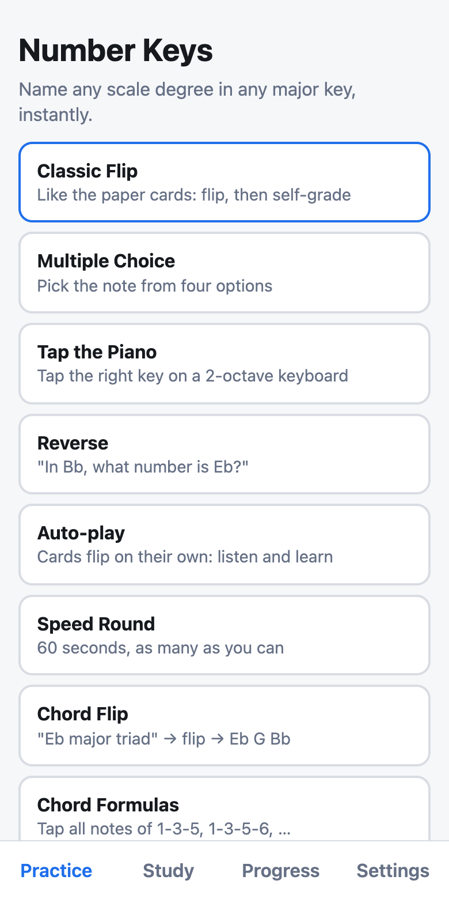

The four tabs along the bottom are **Practice**, **Study**, **Progress** and **Settings**.

## The Practice screen

Every session starts here: pick a mode, narrow down what you want to drill, then tap **Start**. The line under the filters, such as "84 cards selected", tells you how big the session will be.

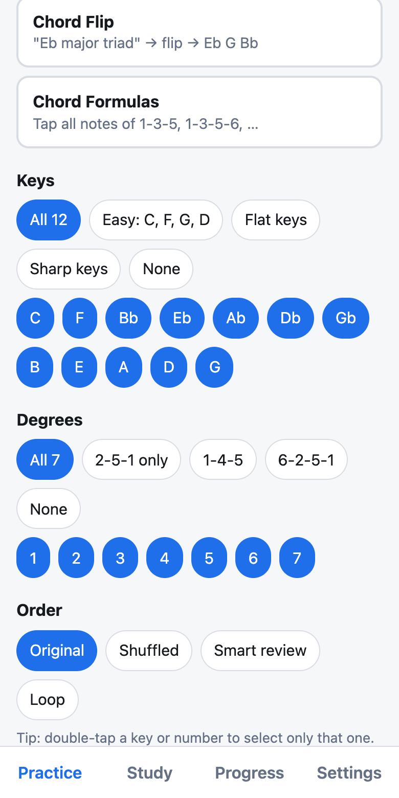

### Keys and Degrees

**Keys** are the 12 major keys, in the order of the circle of fourths: C, F, Bb, Eb, Ab, Db, Gb, B, E, A, D, G. **Degrees** are the scale tones 1 to 7. A card is one key plus one degree, so the cards in a session are every combination of the keys and degrees you leave switched on (blue).

| Shortcut | What it selects |
| --- | --- |
| All 12 / All 7 | Everything |
| Easy: C, F, G, D | Four friendly keys |
| Flat keys | F, Bb, Eb, Ab, Db, Gb |
| Sharp keys | B, E, A, D, G |
| 2-5-1 only | Degrees 1, 2 and 5 |
| 1-4-5 | Degrees 1, 4 and 5 |
| 6-2-5-1 | Degrees 1, 2, 5 and 6 |
| None | Clears the row so you can tap just what you want |

Tap any key or number to switch it on or off. **Double-tap a key or number to select only that one**, which is the quickest way to drill a single key or a single degree.

### Order

- **Original:** like the paper cards. All 12 keys for the 1st tone, then all 12 for the 2nd, and so on.
- **Shuffled:** random order.
- **Smart review:** the 20 cards that need practice most (see [Progress and smart review](#progress-and-smart-review)).
- **Loop** (Classic Flip only): repeats your selected cards until you quit. See [Repeating one card](#repeating-one-card-loop).

The chord modes and the Speed Round use your Keys selection but not the Order options. **Reset filters** puts everything back to all keys, all degrees.

## Scale practice modes

Five modes drill the same 84 cards in different ways. Start with Classic Flip, then move to the faster modes as the notes become automatic.

| Mode | What you do | Best for |
| --- | --- | --- |
| Classic Flip | Flip the card, then grade yourself | Learning new keys |
| Multiple Choice | Pick the note from four options | Building confidence |
| Tap the Piano | Tap the note on a two-octave keyboard | Connecting names to the keys |
| Reverse | See a note, pick its number 1 to 7 | Reading charts and lead sheets |
| Speed Round | 60 seconds, as many as you can | Building speed |

### Classic Flip

The front shows the tone and the key, such as "1st Tone / C". Say the answer, tap the card, and check yourself. The back shows the note and a keyboard with the whole scale marked, with the tone you were asked about highlighted. Then tap **Got it** or **Missed it**. If you turn on **Speak answers** in Settings, the app also says the answer out loud, such as "second tone of F is G".

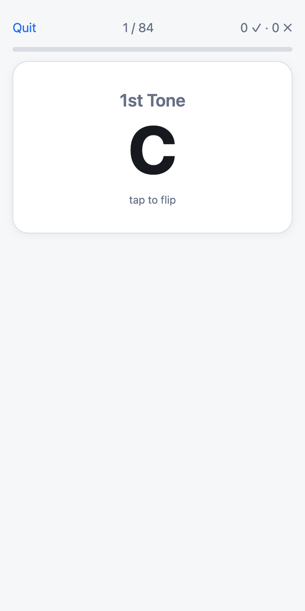 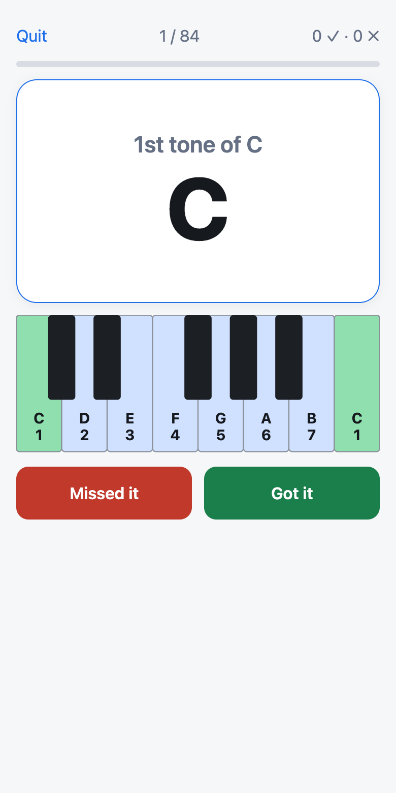

#### Repeating one card (Loop)

To drill a single card until it is automatic, choose **Classic Flip**, set the Order to **Loop**, and double-tap one key and one number (for example Eb and 5). Tap **Start** and the same card comes back after every flip. The top of the screen counts your reps and shows your last, average and fastest flip times, so you can watch the time come down.

Loop works with more than one card too: it cycles through everything you selected until you tap **Quit**. Choosing any other mode turns Loop off.

Loop reps are practice only. They do not change your Progress, boxes or day streak, because the same card back to back is not a real test of memory.

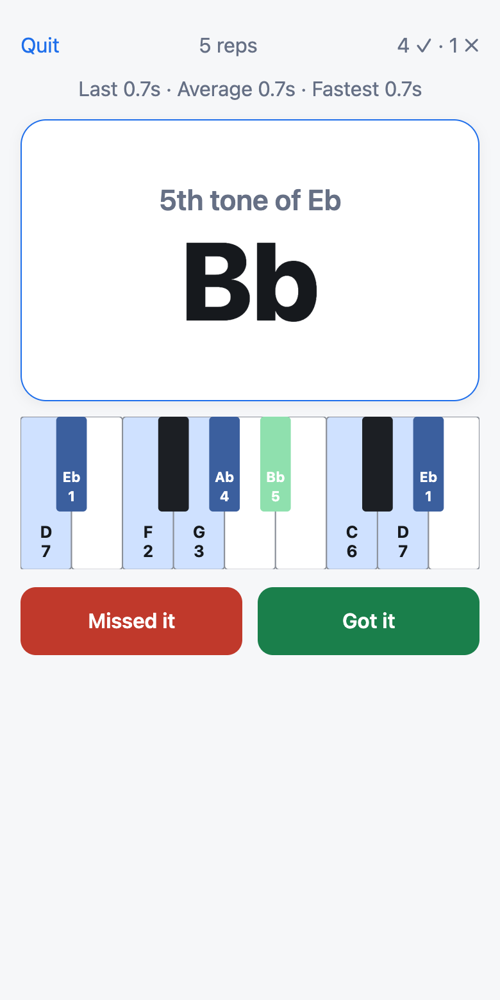

### Multiple Choice

Four options appear. The wrong ones are chosen to be believable: nearby notes, and the other spelling of the same key, such as B next to Cb. After you answer, the right choice turns green. If you missed, a keyboard shows the key's scale so you can learn from it.

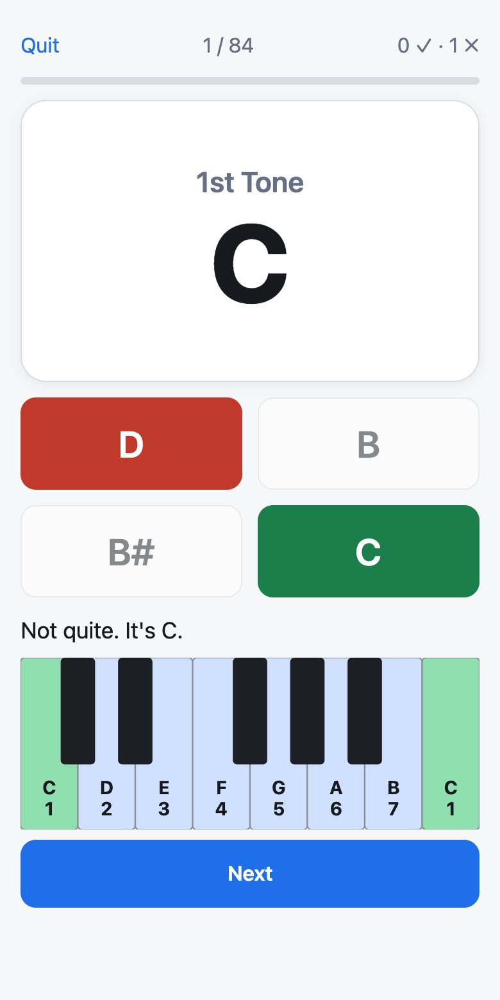

### Tap the Piano

Tap the right key on the on-screen keyboard. Either octave counts. A black key has two names (A# and Bb), so the feedback shows the correct spelling, for example "It's Bb (the same key as A#)".

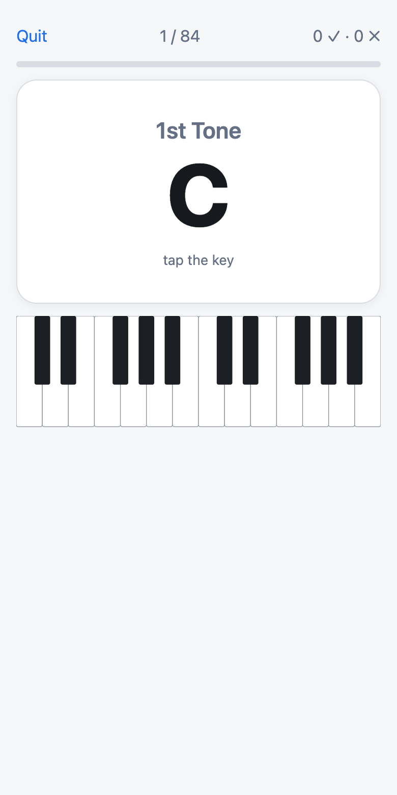

### Reverse

The card shows a note in a key, such as "In the key of Bb, what number is Eb?" Tap the number. The answer here is 4.

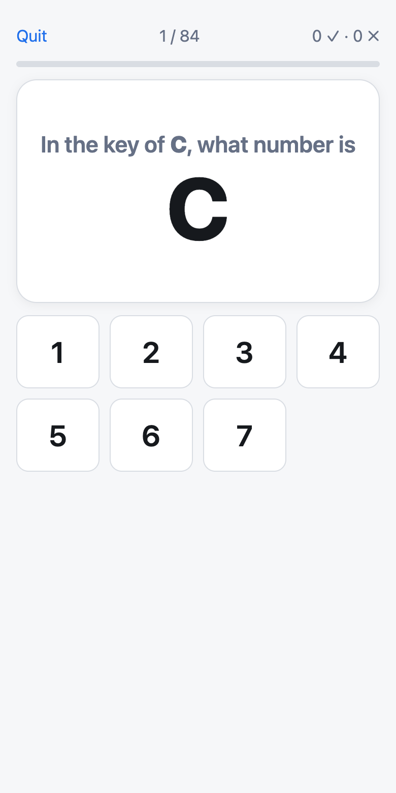

### Speed Round

You get 60 seconds of Multiple Choice. Right answers move on almost immediately, so you can keep a rhythm. When time runs out you see your score and how many you missed. Your best score is saved separately for each combination of keys and degrees, so a round on "Easy keys" is not compared with a round on all 12 keys.

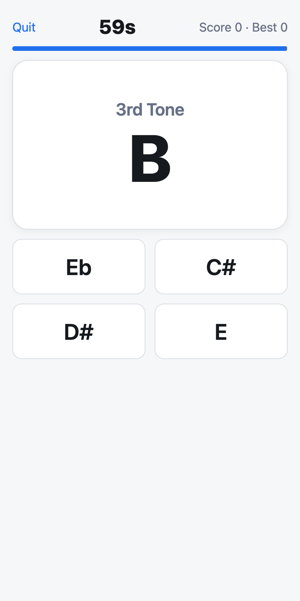

## Chord practice

Two modes drill chords: **Chord Flip** (name the notes, then flip) and **Chord Formulas** (tap the notes on a keyboard). Both cover 16 chord types, built on each of the 12 keys.

| Family | Chord | Formula | Example on C |
| --- | --- | --- | --- |
| Major | Major triad | 1-3-5 | C E G |
| Major | Major 6 | 1-3-5-6 | C E G A |
| Major | Major 7 | 1-3-5-7 | C E G B |
| Major | Add 9 | 1-3-5-9 | C E G D |
| Minor | Minor triad | 1-b3-5 | C Eb G |
| Minor | Minor 6 | 1-b3-5-6 | C Eb G A |
| Minor | Minor 7 | 1-b3-5-b7 | C Eb G Bb |
| Minor | Minor 9 | 1-b3-5-b7-9 | C Eb G Bb D |
| Dominant | Dominant 7 | 1-3-5-b7 | C E G Bb |
| Dominant | Dominant 9 | 1-3-5-b7-9 | C E G Bb D |
| Sus | Sus4 | 1-4-5 | C F G |
| Sus | Sus2 | 1-2-5 | C D G |
| Sus | 7sus4 | 1-4-5-b7 | C F G Bb |
| Dim / Aug | Diminished | 1-b3-b5 | C Eb Gb |
| Dim / Aug | Half-dim m7b5 | 1-b3-b5-b7 | C Eb Gb Bb |
| Dim / Aug | Augmented | 1-3-#5 | C E G# |

### Reading a formula

The numbers are tones of the major scale of the root. A **b** lowers that tone by a half step and a **#** raises it. A **9** is the 2nd tone, an octave higher. So "1-b3-5-b7" on G means G, the 3rd of G major (B) lowered to Bb, D, and the 7th (F#) lowered to F.

### Choosing chord types

The setup screen groups the chords by family. The buttons at the top select a whole family (**Major**, **Minor**, **Dominant**, **Sus**, **Dim / Aug**), **All** or **None**. You can also tap single chords, and **double-tap a chord to select only that one**. By default the four Major chords are selected. Both chord modes use the keys you selected on the Practice screen.

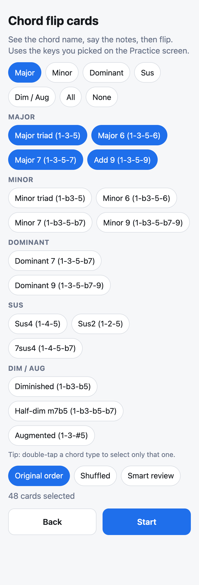

### Chord Flip

The front shows a chord and a key, such as "Minor 7 / Eb". Say the notes, then tap the card. The back shows the notes and the formula, with the chord highlighted on a keyboard. Each key is labeled with the note name and its formula number. Tap **Got it** or **Missed it**. Chord Flip has the same three orders as the scale drills, including **Smart review**.

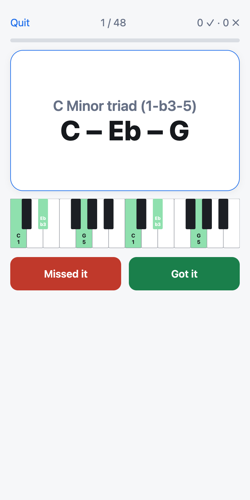

### Chord Formulas

You see a chord and a key, such as "Dominant 9: 1 + 3 + 5 + b7 + 9". Tap every note on the keyboard (**Clear** starts over), then tap **Check**. Any octave counts. The keys turn green for the right notes and red for wrong ones, and the full chord is shown.

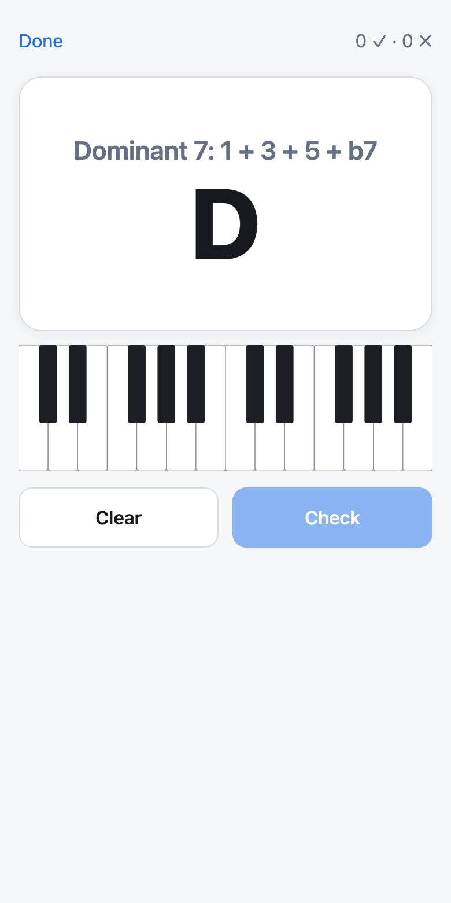

### Why some notes look odd

Number Keys spells notes the way a music theorist would, using each letter once. That means some chords have notes you will not see on a chord chart written for guitar:

- Db minor is Db, **Fb**, Ab (not Db, E, Ab).
- Gb diminished is Gb, **Bbb**, **Dbb**.
- E augmented is E, G#, **B#**.

They are the same keys on the piano as E, A and C. If you prefer to see F# major instead of Gb major, turn on **F# instead of Gb** in Settings.

## The Study tab

Use Study to learn a key or chord before you drill it. It shows one labeled keyboard per key, and it is never available during a quiz. Learn from these, then put them away.

A **Scales | Chords** switch at the top chooses what you see.

### Scales

Twelve keyboards, one per key. The seven scale tones are highlighted. Each one shows its note name above its number, so you can see both how the key is spelled and which tone is which.

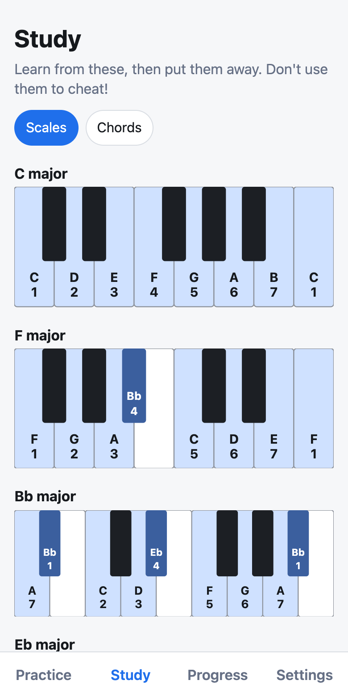

### Chords

Pick a chord type and the 12 keys are listed below it, each as a heading with the notes (for example "Eb Minor 7: Eb – Gb – Bb – Db") and a keyboard. Green keys are the chord tones, labeled with the note name and the formula number.

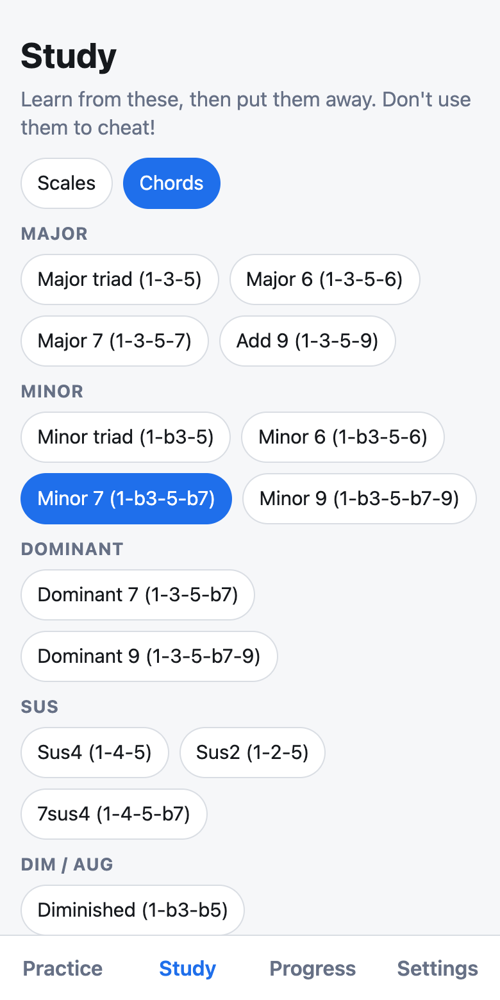

The keyboard always starts on C and covers two octaves, so a note below the root can appear at the left edge. It is the same note an octave up.

## Progress and smart review

Number Keys remembers how every card went, and uses that to decide what to show you next. This works the same for scale cards and chord cards.

### The Leitner boxes

Each card sits in one of five boxes. A correct answer moves it up one box, and a miss sends it back to box 1. The higher the box, the longer the app waits before it asks again.

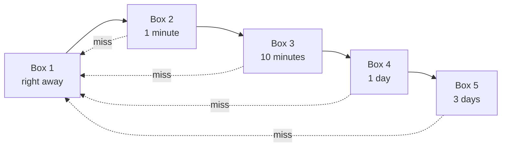

### What "mastered" means

A card counts as mastered when you answer it correctly **and quickly** three times in a row, and it has reached box 4 or 5. "Quickly" is under 3 seconds for scale cards and under 5 seconds for chord cards, since chords have more notes to name. Slow correct answers still move the card up, but they do not count toward mastery.

### Smart review

Choose **Smart review** as the order and the app builds a session of up to 20 cards: cards you have never seen come first, then cards that are due, starting with the lowest boxes (the ones you miss). Cards you know well are left for later.

### The Progress tab

The top shows how many cards you have practiced, your **day streak** (consecutive days you practiced), and how many of the 84 scale cards are mastered and seen.

The **heat-map** has a square for every card. Color shows strength, from red (weak) through yellow to green (mastered). Grey means you have not seen it yet. A number in a square is how many times you have missed it, and a check mark means mastered. Tap a square to see its details: times right and missed, average time, and its box.

This lets you spot patterns, such as "I always miss the 6th in Ab".

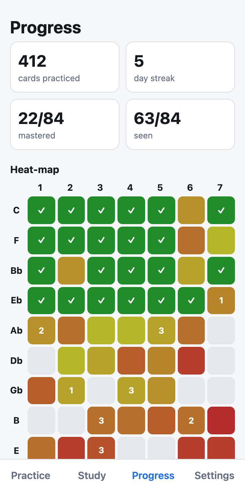

The **Chords** heat-map works the same way, with the 16 chord types down the side and the 12 keys across.

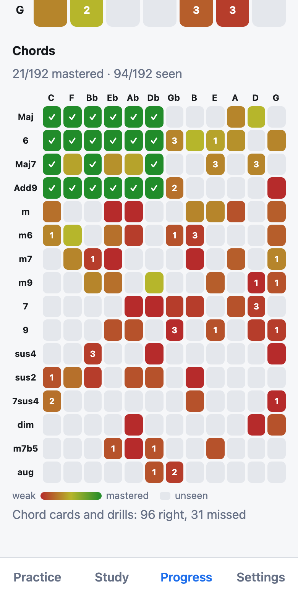

The pictures above use sample data to show what the colors look like. Yours starts empty and fills in as you practice.

## Settings and your data

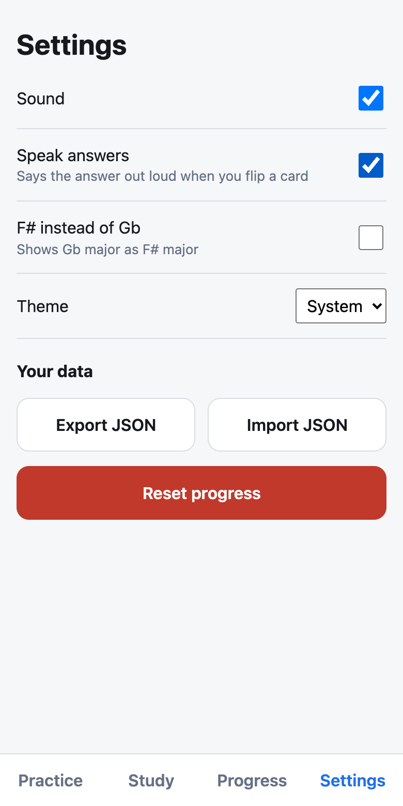

| Setting | What it does |
| --- | --- |
| Sound | Plays the note (or chord) when you answer or flip a card. Turn it off to practice silently. |
| Speak answers | Says the answer out loud when you flip a card in Classic Flip, Loop or Chord Flip, for example "second tone of F is G". Off until you turn it on, and separate from Sound. |
| F# instead of Gb | Shows Gb major as F# major everywhere, including the chords built on it. The keys on the piano are the same. |
| Theme | System follows your phone's light or dark setting. Light and Dark force one. |
| Export JSON | Saves your progress as a file named number-keys-progress-&lt;date&gt;.json. |
| Import JSON | Loads a saved file. It replaces your current progress, and asks you to confirm first. |
| Reset progress | Erases all your progress after a confirmation. Your settings stay. This cannot be undone. |

### Where your progress is kept

Progress is stored in your browser on that one device. There is no account and nothing is sent to a server. This has two consequences:

- The installed app and the same site opened in a browser tab each keep their own progress.
- Clearing your browser's site data erases it.

To back up your progress, or move it to a new phone or a laptop, use **Export JSON** on the old device and **Import JSON** on the new one.

## A practice routine

Short, daily sessions work better than one long one. Ten minutes a day is plenty. This is a suggested plan, not a rule; change the pace to suit you.

| Stage | Focus | How to set it up |
| --- | --- | --- |
| 1. Learn four keys | Get the first keys solid | Study C, F, G and D. Then Practice with the **Easy** keys preset and **Classic Flip** in Original order. |
| 2. All the keys | Add the flat keys, then the sharp keys | Use **Flat keys**, then **Sharp keys**, in Multiple Choice and Tap the Piano. |
| 3. Make it automatic | Speed and spaced review | All 12 keys, **Smart review** every day, and a **Speed Round** now and then to track your best score. |
| 4. Read charts | Think in progressions | Use **Reverse**, and drill the **2-5-1 only** and **6-2-5-1** degrees. |
| 5. Add chords | One family at a time | Study the chords, then **Chord Flip** on the Major family, then Minor, then Dominant, Sus and Dim / Aug. Finish each family with **Chord Formulas**. |

### Tips

- **Say the answer out loud before you flip.** Guessing in your head is easy to fool.
- **Aim for under 3 seconds** per scale card. That is the speed the app counts as quick.
- **Be honest with Got it and Missed it.** A card wrongly marked Got it moves up a box and comes back later than it should.
- **Check Progress weekly.** Red squares are your next practice target; double-tap a key to drill only that one.
- **Study first, then put it away.** Look at a key on the Study tab, then close it before you quiz yourself.

## Troubleshooting and FAQ

**A new feature is not showing up.** Fully close the app and open it again, sometimes twice. On an iPhone, swipe it away in the app switcher first. The installed app keeps the old version until it is closed.

**My progress is gone.** Progress is stored per browser and per device. Check that you are in the same place you practiced before (the installed app or the browser tab), and that site data has not been cleared. If you exported a backup, use **Import JSON** in Settings.

**I hear no sound.** Check that **Sound** is on in Settings and your volume is up. The spoken answers have their own switch, **Speak answers**, and use your device's built-in voice; the setting is greyed out if the browser has no speech support. On an iPhone, the silent switch can mute web audio. Sound starts after your first tap on a card.

**I cannot install it.** Open the site in Safari on iPhone or Chrome on Android. Links opened inside another app's built-in browser usually cannot install it.

**The Start button is greyed out.** Nothing is selected. Choose at least one key and one degree. For the chord modes you need at least one key and one chord type.

**Why does it say Fb, Cb, B# or Bbb?** Notes are spelled with each letter used once, as in standard theory. Gb major, for example, contains Cb, not B. Every scale in the app is checked by an automated test against the whole-whole-half-whole-whole-whole-half pattern. If you would rather see F# major than Gb major, turn on **F# instead of Gb**.

**How do I start fresh?** Settings, then **Reset progress**. Export first if you might want it back.
